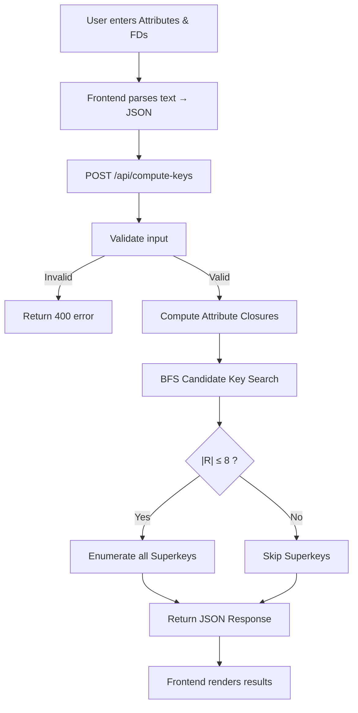

# 🔑 DBMS Key Analyzer

A full-stack web application that computes **Candidate Keys** and **Superkeys** from a given relation and its Functional Dependencies — a core problem in Relational Database Theory.

---

## 📌 Problem Statement

In RDBMS design, identifying **candidate keys** is fundamental for:

- Defining primary keys and ensuring data integrity
- Achieving proper normalization (2NF, 3NF, BCNF)
- Eliminating redundancy and update anomalies

Given a relation **R(A, B, C, …)** and a set of functional dependencies **F**, the tool answers:

| Question | Output |
|---|---|
| What are the **minimal superkeys** (candidate keys)? | Always computed |
| What are **all superkeys**? | Computed only when \|R\| ≤ 8 (to avoid 2ⁿ explosion) |

**Example** — R(A, B, C, D), F = {A → B, B → C, AC → D}:

```
Candidate Keys : {A}
Superkeys      : {A}, {A,B}, {A,C}, {A,D}, {A,B,C}, {A,B,D}, {A,C,D}, {A,B,C,D}
```

---

## 🚀 Setup & Run

### Prerequisites

- **Java 17+** installed (`java -version` to verify)
- No Maven installation needed (wrapper included)

### Steps

```bash
# 1. Clone / navigate to the project
cd "Key Analyzer – RDBMS"

# 2. Build and start the server
java "-Dmaven.multiModuleProjectDirectory=." -classpath ".mvn\wrapper\maven-wrapper.jar" org.apache.maven.wrapper.MavenWrapperMain spring-boot:run

# 3. Open in browser
#    http://localhost:8080
```

The first run will download dependencies (~30s). Subsequent runs start in ~2 seconds.

### Usage

1. Enter comma-separated attributes: `A, B, C, D`
2. Enter FDs (one per line): `A -> B` or `AB -> CD`
3. Click **Compute Keys**
4. View candidate keys, superkeys, and execution stats

---

## 🛠️ Tech Stack

| Layer | Technology |
|---|---|
| **Backend** | Java 17+ · Spring Boot 3.2 |
| **Frontend** | HTML5 · CSS3 · Vanilla JavaScript |
| **Communication** | REST API (JSON) |
| **Build** | Maven 3.9 (via wrapper) |
| **Server** | Embedded Apache Tomcat |

---

## 📁 Project Structure

```
Key Analyzer – RDBMS/
├── pom.xml                              # Maven config
├── mvnw.cmd                             # Maven wrapper (Windows)
├── .mvn/wrapper/                        # Wrapper JARs
└── src/main/
    ├── java/com/keyanalyzer/
    │   ├── KeyAnalyzerApplication.java  # Spring Boot entry point
    │   ├── config/
    │   │   └── WebConfig.java           # CORS configuration
    │   ├── controller/
    │   │   └── KeyController.java       # REST endpoint + timeout guard
    │   ├── core/
    │   │   └── KeyAnalyzer.java         # Pure algorithm (no Spring deps)
    │   ├── model/
    │   │   ├── FunctionalDependency.java
    │   │   ├── KeyRequest.java          # Input DTO
    │   │   └── KeyResponse.java         # Output DTO
    │   └── service/
    │       └── KeyService.java          # Validation + orchestration
    └── resources/
        ├── application.properties
        └── static/
            ├── index.html
            ├── css/style.css            # Dark terminal theme
            └── js/app.js                # FD parser + API client
```

---

## 🔄 Application Flow



---

## 🧠 Algorithm

### 1. Attribute Closure (X⁺)

Computes all attributes functionally determined by a set X under F.

```
CLOSURE(X, F):
    result = X
    repeat
        for each FD (α → β) in F:
            if α ⊆ result:
                result = result ∪ β
    until result does not change
    return result
```

### 2. Candidate Key Discovery (BFS + Pruning)

Avoids brute-force power-set enumeration using two optimizations:

```
FIND-CANDIDATE-KEYS(R, F):
    1. Partition attributes:
         ESSENTIAL  = attributes that NEVER appear on any RHS  (must be in every key)
         NON-ESSENTIAL = all other attributes

    2. If CLOSURE(ESSENTIAL, F) = R  →  return {ESSENTIAL}

    3. BFS — expand ESSENTIAL by adding one non-essential attribute at a time:
         Queue ← { ESSENTIAL ∪ {x} | x ∈ NON-ESSENTIAL }
         while Queue is not empty:
             current = dequeue
             if current is a SUPERSET of any known candidate key → PRUNE
             if CLOSURE(current, F) = R  → save as candidate key (don't expand further)
             else → enqueue { current ∪ {y} | y comes after max(current) }

    4. Return all candidate keys sorted by size
```

### 3. Superkey Generation

- **|R| ≤ 8** → Enumerate all 2ⁿ − 1 non-empty subsets, check each via attribute closure
- **|R| > 8** → Skip with message (exponential growth)

---

## 🗂️ Data Structures

| Structure | Usage |
|---|---|
| `Set<String>` (LinkedHashSet) | Attribute sets — preserves insertion order, O(1) lookup for closure |
| `List<FunctionalDependency>` | Ordered collection of FDs for iterative closure computation |
| `Queue<Set<String>>` (LinkedList) | BFS frontier for level-wise candidate key expansion |
| `Set<String>` (HashSet) | Visited-set for BFS — canonical string keys prevent duplicate exploration |
| `List<Set<String>>` | Accumulator for discovered candidate keys and superkeys |
| Bitmask (`int`) | Superkey enumeration — each bit represents an attribute (≤ 8 attrs) |

---

## 🔌 API Reference

### `POST /api/compute-keys`

**Request:**
```json
{
  "attributes": ["A", "B", "C", "D"],
  "fds": [
    { "left": ["A"],      "right": ["B"] },
    { "left": ["B"],      "right": ["C"] },
    { "left": ["A", "C"], "right": ["D"] }
  ]
}
```

**Response:**
```json
{
  "candidateKeys": [["A"]],
  "superkeys": [["A"], ["A","B"], ["A","C"], ["A","D"], ...],
  "info": {
    "attributeCount": 4,
    "strategy": "Optimized BFS with RHS-reduction pruning",
    "executionTimeMs": 3,
    "stepsCount": 26
  }
}
```

| Status | Condition |
|---|---|
| `200` | Success |
| `400` | Invalid input (missing attributes, unknown attribute in FD) |
| `408` | Computation timed out (> 10 seconds) |

---

## ⚡ Performance

| Attributes | Candidate Keys | Superkeys | Behavior |
|---|---|---|---|
| ≤ 8 | ✅ Computed | ✅ Computed | Full analysis |
| 9 – 15 | ✅ Computed | ⚠️ Skipped | CK via pruned BFS, superkeys too expensive |
| > 15 | ✅ Computed | ⚠️ Skipped | 10s timeout guard prevents freeze |

---

## 📄 License

This project is licensed under the MIT License.
